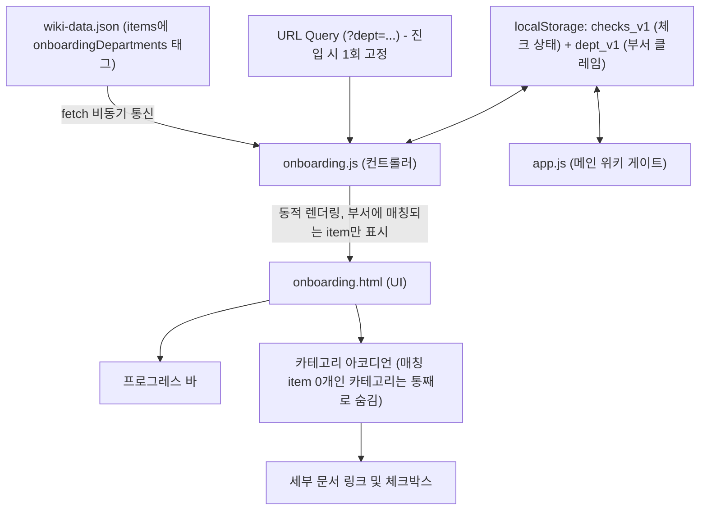

# 🤝 팀 사내 위키 온보딩 기능 인수인계 문서 (Handoff)

> **작성일**: 2026-08-31 (최종 수정: 2026-08-31)  
> **작업 브랜치**: `onboarding`  
> **주요 내용**: 신규 입사자 전용 부서별 온보딩 체크리스트 페이지(`onboarding.html`) 구축, 명단 파일 기반 개인화 링크 생성, 문서 단위 부서 필터링, 메인 위키 열람 잠금(gate), 전체/세부 체크박스 동기화 버그 수정

---

## 1. 📌 작업 개요 및 목적

- **배경**: 기존 메인 위키(`index.html`)는 모든 카테고리와 문서가 나열되어 있어, 신규 입사자가 본인 직무에 맞춰 무엇을 먼저 확인해야 할지 파악하기 어려웠습니다.
- **목적**: 
  - 신규 입사자에게 꼭 필요한 문서들을 **부서별 맞춤 체크리스트** 형태로 제공합니다.
  - 기존 데이터 소스인 `wiki-data.json`을 100% 재사용하여 데이터 이원화를 방지합니다.
  - 체크리스트 진행률 및 브라우저 저장(`localStorage`) 기능을 통해 자기주도적 온보딩 경험을 지원합니다.

---

## 2. 🖥️ 화면 구성 (Screens & UI)

### 1) 신규 입사자 온보딩 체크리스트 (`onboarding.html`)
신규 입사자가 부서 전용 링크 또는 탭을 통해 접속하여 필수 문서를 확인하는 독립 페이지입니다.

- **상단 헤더 영역**:
  - `← 메인 위키 홈으로` 바로가기 버튼 (온보딩 미완료 시 클릭해도 이동하지 않고 안내 모달만 뜸) & `NEW ONBOARDING GUIDE` 뱃지
  - 부서별 맞춤 타이틀 (예: *개발팀 신규 입사자 온보딩 체크리스트*)
  - ~~부서 선택 탭(Pill UI)~~ **제거됨** — 부서는 페이지 안에서 전환하지 않고 URL 쿼리(`?dept=...`)로만 고정 진입한다. 신규 입사자에게 본인 부서 링크만 전달하는 구조.
- **온보딩 진행 현황 카드**:
  - 실시간 프로그레스 바 & 퍼센트/카운터 게이지 (`X / Y 완료 (XX%)`)
  - 상태 초기화 버튼 (`체크 초기화`)
  - 진행 상태별 응원 및 완료 축하 메시지
- **카테고리 단위 아코디언 체크리스트**:
  - 카테고리 헤더: 카테고리 아이콘 + **`"[카테고리명] 관련 문서는 여기서 확인하세요"`** 친절한 문구 + 카테고리 일괄 체크박스 + 완료 뱃지 + 토글 화살표
  - 아코디언 본문: 각 세부 문서 카드 (개별 체크박스 + 문서명 + 새 창 링크 아이콘 + 문서 설명 + 담당자 뱃지 + 최종 업데이트일)
- **하단 서포트 배너**: 운영 담당자 문의 및 메인 위키 안내

### 2) 메인 사내 위키 (`index.html`)
- 상단 헤더 우측에 **`신규 입사자 온보딩 🚀`** 바로가기 링크 버튼을 추가하여 메인 위키와 온보딩 페이지 간의 이동을 원활하게 연결했습니다.
- 바로가기 옆의 **`신규입사자 링크 생성하기`** 버튼에서 이름·부서·입사일 명단(`.xlsx`, `.xls`, `.csv`, `.txt`)을 업로드하면 부서와 이름이 포함된 개인별 온보딩 링크를 표로 생성합니다.
- **온보딩 완료 전 접근 잠금**: 온보딩 페이지를 거쳐 온 브라우저(= `localStorage`에 부서 클레임이 남아있는 경우)가 필수 문서를 다 체크하지 않았다면, 메인 위키 진입 시 전체 화면이 "온보딩을 먼저 완료해주세요" 안내와 온보딩 페이지 링크로 대체됩니다. 온보딩을 거친 적 없는 기존 직원은 그대로 통과합니다.

---

## 3. ⚙️ 핵심 기능 및 동작 원리



### 1) URL 파라미터 기반 부서별 다이렉트 링크
- 신규 입사자에게 직무별 링크를 전달하여 맞춤형 화면으로 바로 진입합니다. 페이지 안에는 부서를 바꾸는 UI가 없으므로, 다른 부서 화면을 보려면 링크 자체를 바꿔 접속해야 합니다.
  - **개발팀**: `onboarding.html?dept=engineering`
  - **디자인팀**: `onboarding.html?dept=design`
  - **기획팀**: `onboarding.html?dept=planning`
  - **운영/CX팀**: `onboarding.html?dept=operations`
- 진입 시 `currentDept`가 `localStorage`(`team_wiki_onboarding_dept_v1`)에 저장되어, 이후 메인 위키 게이트(`app.js`)가 "이 브라우저는 어느 부서 온보딩을 받아야 하는지" 판단하는 근거가 됩니다.

### 2) 문서(item) 단위 부서 필터링
- ~~카테고리 단위로 부서를 매핑하던 `DEPARTMENTS.categoryIds` 방식은 제거되었습니다.~~ 이제는 `wiki-data.json`의 **각 문서(item)** 에 `onboardingDepartments: ["engineering", ...]` 배열을 붙여, 해당 배열에 현재 부서가 포함된 문서만 노출합니다.
- 카테고리는 그 안에 현재 부서용 문서가 **1개라도 있을 때만** 표시되고, 매칭되는 문서가 0개면 카테고리 전체가 화면에서 숨겨집니다 (`getDepartmentCategories()` 참고, `onboarding.js`).
- `DEPARTMENTS` 객체(`onboarding.js`)는 이제 부서 표시 이름/아이콘만 담당하고, 어떤 문서를 보여줄지는 전적으로 `wiki-data.json` 쪽 데이터로 제어합니다.

### 3) 이중 체크박스 & 아코디언 인터랙션
- **카테고리 아코디언 토글**: 카테고리 행 클릭 시 아코디언이 부드럽게 열리고 닫힙니다. (첫 번째 카테고리는 기본 펼침)
- **세부 문서 체크**: 개별 문서를 체크하면 완료 취소선 및 딤드 스타일이 적용되며, 상단 진행률이 즉시 갱신됩니다.
- **카테고리 체크박스 연동**:
  - 카테고리 체크박스를 클릭하면 해당 카테고리의 모든 세부 문서가 일괄 체크/해제됩니다.
  - 세부 문서가 모두 체크되면 카테고리 체크박스 및 카드가 완료 상태(초록색 뱃지)로 자동 변경됩니다.
  - **[2026-08-31 버그 수정]** 카테고리 체크박스의 `<label>`에 걸려 있던 `onclick="event.stopPropagation()"`가 클릭 이벤트를 `checklistContainer`의 위임 리스너까지 도달하기 전에 막고 있어, 전체 체크박스가 브라우저 기본 동작으로 시각적으로만 체크되고 실제로는 세부 문서가 하나도 같이 체크/해제되지 않는 버그가 있었습니다. `stopPropagation` 제거 + 아코디언 토글 로직에 "클릭이 체크박스에서 시작됐으면 무시" 가드를 추가하는 방식으로 근본 수정했습니다 (`onboarding.js` `setupEventListeners`).

### 4) 메인 위키 열람 잠금 (`app.js`, `checkOnboardingGate`)
- 온보딩 페이지를 거친 브라우저(부서 클레임이 `localStorage`에 있음)가 자신의 부서에 필요한 문서를 전부 체크하지 않은 상태로 메인 위키(`index.html`)에 접근하면, 렌더링 대신 "온보딩을 먼저 완료해주세요" 안내 화면 + 온보딩 링크로 전체 화면을 대체합니다.
- 온보딩을 시작한 적 없는 브라우저(부서 클레임 없음, 예: 기존 재직자)는 게이트를 그대로 통과합니다.
- **주의**: 로그인/서버 세션이 없는 정적 사이트이므로 이는 실제 접근 제어가 아니라 `localStorage` 기반의 클라이언트 소프트 락입니다. 개발자도구로 `localStorage`를 지우면 우회됩니다 — 정적 페이지 구조상 이 이상의 강제는 불가능하며, 서버/인증이 붙기 전까지는 의도된 한계입니다.
- **캐시 주의**: 정적 서버(`python3 -m http.server`)는 캐시 무효화 헤더를 보내지 않으므로, `link-generator.js` 등 스크립트를 수정한 뒤 테스트할 때는 일반 새로고침이 아니라 하드 리프레시(Cmd+Shift+R)로 확인해야 합니다.

### 5) 브라우저 로컬 저장소(`localStorage`) 영속성
- `team_wiki_onboarding_checks_v1`: 체크 상태, `{ [itemId]: boolean }`
- `team_wiki_onboarding_dept_v1`: 온보딩 진입 시 고정된 부서 코드 (메인 위키 게이트가 참조)
- `team_wiki_onboarding_name_v1`: 개인화 링크의 이름. URL의 `name` 값이 있으면 갱신하고, 이후 새로고침에서는 저장값을 사용
- 페이지 새로고침이나 브라우저 재접속 후에도 체크 진행 상태가 완벽하게 복원됩니다.
- "체크 초기화" 버튼을 누르면 확인 팝업 후 현재 부서의 체크 상태를 리셋할 수 있습니다.

### 6) 명단 파일 기반 개인화 링크 생성 (`link-generator.js`)
- CSV/TXT는 줄바꿈과 쉼표로 직접 분리하고, Excel은 CDN으로 로드한 SheetJS의 첫 시트를 2차원 배열로 변환한 뒤 동일한 행 처리 로직을 사용합니다.
- 첫 행의 부서 값이 지원 부서와 일치하지 않으면 헤더로 간주합니다. 지원 값은 개발팀/개발, 디자인팀/디자인, 기획팀/기획, 운영/CX팀/운영/CX/운영팀입니다.
- 매칭된 행은 `buildOnboardingUrl()`을 통해 링크를 생성합니다. 매칭 실패 행은 원본 부서명과 함께 실패 상태만 표시하므로 원본 명단을 수정해 다시 업로드해야 합니다.
- 개인화 링크로 접속하면 타이틀 위에 `OOO님, 환영합니다!`가 표시됩니다. 입사일은 입력 형식 호환을 위해 읽지만 링크와 결과 표에는 사용하지 않습니다.
- **[2026-08-31 버그 수정]** 링크를 `onboarding.html?dept=...` 상대경로 문자열로만 만들어서, 결과 표에서 텍스트로 복사하면 도메인이 빠진 조각만 복사되어 붙여넣어도 페이지로 이동할 수 없었습니다. `buildOnboardingUrl()`이 `new URL('onboarding.html', window.location.href)`로 현재 페이지 기준 절대 URL을 만들도록 수정해, 로컬 개발 서버(`http://localhost:8088/...`)와 배포 주소(서브경로 포함) 어디서든 온전한 절대 URL이 복사되도록 근본 수정했습니다.

---

## 4. 📁 파일 구조 및 변경 내역

```text
team-wiki/
├── docs/
│   └── wiki-plan.md         # 사내 위키 프로젝트 기획서
├── app.js                   # [수정] 메인 위키 스크립트 + 온보딩 미완료 시 열람 잠금(checkOnboardingGate)
├── index.html               # [수정] 온보딩 바로가기 + 개인화 링크 생성 모달 및 SheetJS CDN 연결
├── style.css                # [수정] 헤더 액션, 링크 생성 모달, 업로드/결과 표 스타일
├── link-generator.js        # [신규] 명단 파일 파싱, 부서 매핑, 개인화 링크 생성 및 복사
├── wiki-data.json           # [수정] 위키 데이터셋 (단일 데이터 소스). 각 item에 onboardingDepartments 태그 추가
├── onboarding.html          # [신규/수정] 부서별 체크리스트 마크업 + 개인 이름 환영 문구 영역
├── onboarding.js            # [신규/수정] 부서 필터, 체크/진행률, 이동 차단 + 이름 URL/localStorage 처리
├── onboarding.css           # [신규/수정] 체크리스트, 아코디언, 프로그레스 바 + 이름 환영 문구
├── handoff.md               # [신규] 온보딩 기능 인수인계 문서 (본 문서)
└── README.md                # [수정] 온보딩 기능 설명 및 구조 업데이트
```

---

## 5. 🛠 유지보수 및 확장 가이드 (For Next Maintainer)

### 1) 새로운 부서(직군)를 추가하고 싶을 때
1. [`onboarding.js`](file:///Users/yangjeonghwa/fast/fastcampus-ai/team-wiki/onboarding.js)의 `DEPARTMENTS` 객체에 표시용 이름/아이콘만 추가합니다 (카테고리 매핑은 더 이상 여기서 하지 않습니다).
   ```javascript
   // onboarding.js 예시: 마케팅팀 추가
   marketing: { name: '마케팅팀', icon: 'megaphone' }
   ```
2. [`wiki-data.json`](file:///Users/yangjeonghwa/fast/fastcampus-ai/team-wiki/wiki-data.json)에서 마케팅팀 신규 입사자에게 보여줄 각 문서(item)의 `onboardingDepartments` 배열에 `"marketing"`을 추가합니다. 이 배열에 부서 코드가 없는 문서는 해당 부서 화면에 노출되지 않습니다.
3. 신규 입사자에게는 `onboarding.html?dept=marketing` 링크를 전달합니다.

### 2) 새로운 문서나 카테고리를 추가하고 싶을 때
- 코드를 수정할 필요 없이 [`wiki-data.json`](file:///Users/yangjeonghwa/fast/fastcampus-ai/team-wiki/wiki-data.json)에 새 카테고리나 `items`를 추가하면 메인 위키에 자동으로 반영됩니다.
- 다만 온보딩 체크리스트에도 보이게 하려면, 그 item에 **반드시 `onboardingDepartments` 배열을 채워야** 합니다. 이 필드가 없거나 빈 배열이면 어떤 부서 화면에도 나타나지 않습니다.

### 3) 로컬 실행 및 테스트 방법
```bash
# 로컬 웹 서버 구동
python3 -m http.server 8088

# 브라우저 접속 테스트
http://localhost:8088/onboarding.html?dept=engineering
```
