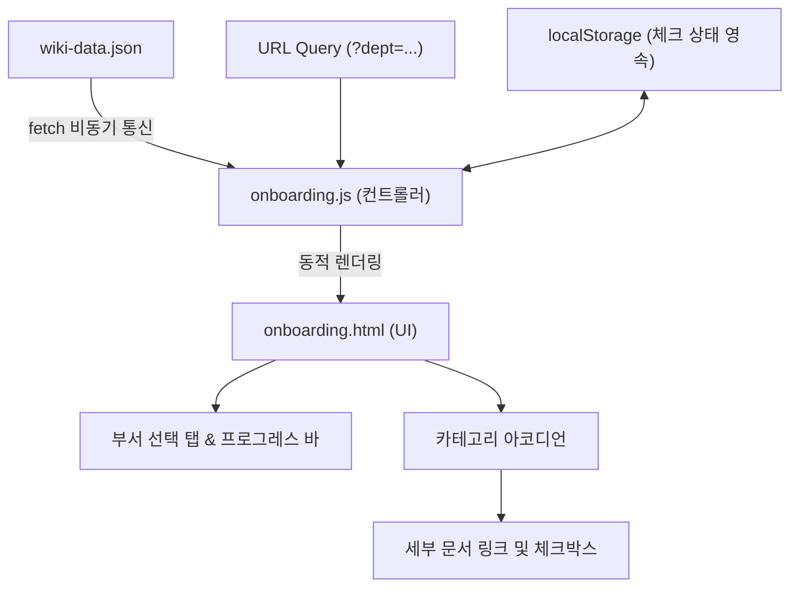

# 🤝 팀 사내 위키 온보딩 기능 인수인계 문서 (Handoff)

> **작성일**: 2026-08-31  
> **작업 브랜치**: `onboarding`  
> **주요 내용**: 신규 입사자 전용 부서별 온보딩 체크리스트 페이지(`onboarding.html`) 구축 및 메인 위키 연동

---

## 1. 📌 작업 개요 및 목적

- **배경**: 기존 메인 위키(`index.html`)는 모든 카테고리와 문서가 나열되어 있어, 신규 입사자가 본인 직무에 맞춰 무엇을 먼저 확인해야 할지 파악하기 어려웠습니다.
- **목적**: 
  - 신규 입사자에게 꼭 필요한 문서들을 **부서별 맞춤 체크리스트** 형태로 제공합니다.
  - 기존 데이터 소스인 `wiki-data.json`을 100% 재사용하여 데이터 이원화를 방지합니다.
  - 체크리스트 진행률 및 브라우저 저장(`localStorage`) 기능을 통해 자기주도적 온보딩 경험을 지원합니다.

---

## 2. 🖥️ 화면 구성 (Screens & UI)

### 1) 신규 입사자 온보딩 체크리스트 (`onboarding.html`)
신규 입사자가 부서 전용 링크 또는 탭을 통해 접속하여 필수 문서를 확인하는 독립 페이지입니다.

- **상단 헤더 영역**:
  - `← 메인 위키 홈으로` 바로가기 버튼 & `NEW ONBOARDING GUIDE` 뱃지
  - 부서별 맞춤 타이틀 (예: *개발팀 신규 입사자 온보딩 체크리스트*)
  - **부서 선택 탭 (Pill UI)**: 개발팀, 디자인팀, 기획팀, 운영/CX팀, 전체 보기
- **온보딩 진행 현황 카드**:
  - 실시간 프로그레스 바 & 퍼센트/카운터 게이지 (`X / Y 완료 (XX%)`)
  - 상태 초기화 버튼 (`체크 초기화`)
  - 진행 상태별 응원 및 완료 축하 메시지
- **카테고리 단위 아코디언 체크리스트**:
  - 카테고리 헤더: 카테고리 아이콘 + **`"[카테고리명] 관련 문서는 여기서 확인하세요"`** 친절한 문구 + 카테고리 일괄 체크박스 + 완료 뱃지 + 토글 화살표
  - 아코디언 본문: 각 세부 문서 카드 (개별 체크박스 + 문서명 + 새 창 링크 아이콘 + 문서 설명 + 담당자 뱃지 + 최종 업데이트일)
- **하단 서포트 배너**: 운영 담당자 문의 및 메인 위키 안내

### 2) 메인 사내 위키 (`index.html`)
- 상단 헤더 우측에 **`신규 입사자 온보딩 🚀`** 바로가기 링크 버튼을 추가하여 메인 위키와 온보딩 페이지 간의 이동을 원활하게 연결했습니다.

---

## 3. ⚙️ 핵심 기능 및 동작 원리



### 1) URL 파라미터 기반 부서별 다이렉트 링크
- 신규 입사자에게 직무별 링크를 전달하여 맞춤형 화면으로 바로 진입 가능합니다.
  - **개발팀**: `onboarding.html?dept=engineering`
  - **디자인팀**: `onboarding.html?dept=design`
  - **기획팀**: `onboarding.html?dept=planning`
  - **운영/CX팀**: `onboarding.html?dept=operations`
  - **전체 보기**: `onboarding.html?dept=all`
- 부서 탭 클릭 시 `history.replaceState`로 URL 파라미터가 실시간 업데이트되어 즉시 공유 가능합니다.

### 2) 부서별 카테고리 매핑 규칙 (`DEPARTMENTS`)
공통 필수 문서와 직무별 특화 문서를 조합하여 카테고리를 필터링합니다.

| 부서 코드 (`dept`) | 부서명 | 포함되는 카테고리 ID |
| :--- | :--- | :--- |
| **공통 (기본 포함)** | - | `people` (인사/근태), `expense-purchase` (경비/구매), `project-collaboration` (프로젝트/협업) |
| `engineering` | 개발팀 | 공통 + `engineering` (개발과 엔지니어링) |
| `design` | 디자인팀 | 공통 + `design` (디자인과 UI/UX), `brand-assets` (브랜드와 자료) |
| `planning` | 기획팀 | 공통 + `planning` (기획과 프로덕트) |
| `operations` | 운영/CX팀 | 공통 + `customer-operations` (고객 응대와 운영) |
| `all` | 전체 보기 | 전체 8개 카테고리 |

### 3) 이중 체크박스 & 아코디언 인터랙션
- **카테고리 아코디언 토글**: 카테고리 행 클릭 시 아코디언이 부드럽게 열리고 닫힙니다. (첫 번째 카테고리는 기본 펼침)
- **세부 문서 체크**: 개별 문서를 체크하면 완료 취소선 및 딤드 스타일이 적용되며, 상단 진행률이 즉시 갱신됩니다.
- **카테고리 체크박스 연동**:
  - 카테고리 체크박스를 클릭하면 해당 카테고리의 모든 세부 문서가 일괄 체크/해제됩니다.
  - 세부 문서가 모두 체크되면 카테고리 체크박스 및 카드가 완료 상태(초록색 뱃지)로 자동 변경됩니다.

### 4) 브라우저 로컬 저장소(`localStorage`) 영속성
- 키: `team_wiki_onboarding_checks_v1`
- 저장 데이터: `{ [itemId]: boolean }`
- 페이지 새로고침이나 브라우저 재접속 후에도 체크 진행 상태가 완벽하게 복원됩니다.
- "체크 초기화" 버튼을 누르면 확인 팝업 후 현재 부서의 체크 상태를 리셋할 수 있습니다.

---

## 4. 📁 파일 구조 및 변경 내역

```text
team-wiki/
├── docs/
│   └── wiki-plan.md         # 사내 위키 프로젝트 기획서
├── app.js                   # [기존] 메인 위키 스크립트
├── index.html               # [수정] 상단 헤더에 온보딩 바로가기 버튼 추가
├── style.css                # [수정] 헤더 액션 영역 스타일 추가
├── wiki-data.json           # [기존] 위키 데이터셋 (단일 데이터 소스)
├── onboarding.html          # [신규] 신규 입사자 온보딩 체크리스트 마크업
├── onboarding.js            # [신규] 온보딩 데이터 로드, 부서 필터, 아코디언, 체크 및 진행률 로직
├── onboarding.css           # [신규] 온보딩 전용 스타일시트 (체크리스트, 아코디언, 프로그레스 바)
├── handoff.md               # [신규] 온보딩 기능 인수인계 문서 (본 문서)
└── README.md                # [수정] 온보딩 기능 설명 및 구조 업데이트
```

---

## 5. 🛠 유지보수 및 확장 가이드 (For Next Maintainer)

### 1) 새로운 부서(직군)를 추가하고 싶을 때
[`onboarding.js`](file:///Users/yangjeonghwa/fast/fastcampus-ai/team-wiki/onboarding.js)의 `DEPARTMENTS` 객체에 새로운 부서 키와 매핑할 `categoryIds`를 추가하고, [`onboarding.html`](file:///Users/yangjeonghwa/fast/fastcampus-ai/team-wiki/onboarding.html)의 `#deptTabs` 영역에 버튼을 추가합니다.

```javascript
// onboarding.js 예시: 마케팅팀 추가
marketing: {
  name: '마케팅팀',
  icon: 'megaphone',
  categoryIds: ['people', 'expense-purchase', 'project-collaboration', 'brand-assets']
}
```

### 2) 새로운 문서나 카테고리를 추가하고 싶을 때
- 코드를 수정할 필요 없이 [`wiki-data.json`](file:///Users/yangjeonghwa/fast/fastcampus-ai/team-wiki/wiki-data.json)에 새 카테고리나 `items`를 추가하면 메인 위키와 온보딩 체크리스트에 자동으로 반영됩니다.

### 3) 로컬 실행 및 테스트 방법
```bash
# 로컬 웹 서버 구동
python3 -m http.server 8088

# 브라우저 접속 테스트
http://localhost:8088/onboarding.html?dept=engineering
```
